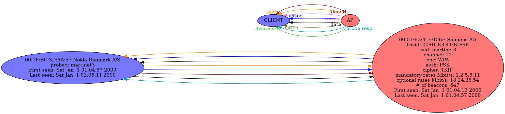

# WiGraph

#### A simple to use program to visualise what's happening in a PCAP containing IEEE802.11 frames.

## Usage

To create a graph:

`./wigraph.py -p <pcap file> -o <output name w/o extension>`

This is the base command, you can use other parameters as well.

Wigraph can parse PCAP __and__ PCAP-NG files.

#### Format

This will generate a PNG file containing the graph. If you want another format, you can use the `-f` argument followed by the format :
- jpg
- gif
- svg
- svgz
- pdf
- dot (source file for [GraphViz](https://graphviz.org/))
- ps
- png

#### Optimization

If your pcap file contains a lot of traffic with a lot of differents hosts, the image will be really big and will take a long time to generate. To avoid this, you can split the graph into multiple images. To do this, you can use the `-s` argument:

`./main.py -p <pcap file> -o <output name w/o extension> -s`

This will generate each subgraphs __AND__ an image containing all nodes without edges, if you don't want it, you can use the `-a` parameter.

Otherwise, you can use the `-n` parameter to remove all nodes without any edge and keep everything in one image, but keep in mind that the final image may still be large.

Even if you split the graph, images can be really big. You can choose to not draw probe responses with the `-e` argument, this will let the program able to split a bit more graphs. If you want to ignore all probe responses altogether, you may want to use the `-i` argument instead.

WiGraph uses [GraphViz](https://graphviz.org/) to generate the output. The default program used is _sfdp_. You can choose another program by using the `-g` argument followed by the name of the program :
- dot
- neato
- twopi
- circo
- fdp
- sfdp

By default the program tries to do an OUI lookup. This may takes some memory and some time so you can disable it by using the `-k` argument.

#### Filter

You can filter frames by either their MAC addresses (works with the source and destination) with the `-m` argument followed by one or multiple MAC addresses seperated by space.
You can also filter by BSSID with the `-b` argument followed by one or multiple BSSIDs seperated by spaces.

## Exemple

Here is an exemple using the [Network_Join_Nokia_Mobile.pcap](https://wiki.wireshark.org/SampleCaptures?action=AttachFile&do=get&target=Network_Join_Nokia_Mobile.pcap) from [Wireshark samples](https://wiki.wireshark.org/SampleCaptures):

It was generated with:

`./wigraph.py -p Network_Join_Nokia_Mobile.pcap -o exemple.png`

### Dependencies

WiGraph required some dependencies:
- `dpkt` to parse frames
- `networkx` to represent the graph in memory and drawing it to a file

You can install theses dependencies automatically by using the `requirements.txt` file :

`pip install -r requirements.txt`

## Disclamer

Sometimes a node will be marked as a repeater (green node). This means that the station has send frames typically sent by an AP and some sent by a client. It can be a false positive, like a smartphone with wifi activated switching to AP-mode.

## Note

WiGraph is 100% passive, this means it doesn't send __ANY__ frame.
Furthermore this program can easily be used in a script because it doesn't require any input once run.
